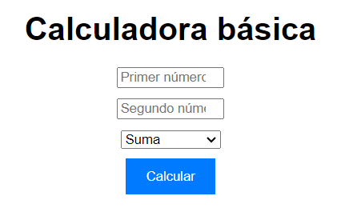

# Calculadora Básica
- Versión: 1.0.0
- Autor: **Kyllian Arribas Garcia**
- Licencia: MIT





## Descripción y objetivos:
Esta aplicación tiene como intención calcular las notas del equipo cliente y mostrarlas por pantalla.
Tiene como objetivo **facilitar** el trabajo administrativo a los diferentes docentes.

## Funcionalidades: 

Es posible operar con [**+**, **-**, **x** o **/**], pudiendo cambiar entre las mismas opciones expuesa en el desplegable más arriba enseñado.


## Guia de Instalación
**Descarga** el zip desde esta url: 
[https://github.com/yekaos/calculadorabasica.git](https://github.com/yekaos/calculadorabasica.git)
o en el shell realiza un git clone.
```shell
git clone https://github.com/yekaos/calculadorabasica.git
```
Una vez descargado **inclúyalo** en su repositorio y ejecutelo a través de su navegador de preferencia
```
http://localhost:3000/calculadorabasica
```

## Tecnologías utilizadas y arquitectura.
**HTML5, CSS y JS**


El **index** está basado en los diferentes inputs para agregar los datos, el **css** da un aspecto básico a la misma, que se irá mejorando con el tiempo y el **script** en la función "calcular" y sus posible ifs y resulados.


## Instrucciones de uso
1. Introduce el primer número en la primera casilla.
2. Introduce el segundo número en la segunda casilla.
3. Elige en el desplegable la operaión que desea hacer.
4. Pulsa el botón para visualizar el resultado de la operación deseada.

## Solución de posibles problemas:
- Si hay un número que no está disponible, aparecerá el siguiente mensaje: *"En ambos campos se deben introducir números"*
- Si la operación no fuese valida aparecerá en pantalla: *"Operación no válida"*
- No se puede dividir entre cero, si se intenta, saldrá el mensaje: *"No se puede dividir entre cero"*
- Se puede operar con números negativos, si la operación, por cualquier motivo, resulta en error, contacte con nosotros para subsanarlo lo antes posible.
## Información de contacto:
Puede contactar con nostros, o proponer su contribución a través del correo:
[kyarribas@gmail.com](mailto:kyarribas@gmail.com)

[Teléfono: 555444222](tel:+34555444222)

### Reconocimientos:
>Agradecimientos a MDN por sus tutoriales.


### Apéndices:
Más información en nuestro github:
[yekaos](https://yekaos.github.io)

## Versiones
|Versión|Fecha|Cambios|
|--|--|--|
|0.1|17/04/24|Funcionalidad básica|
|0.9|18/04/24|Correción de errores de funcionamiento|
|1.0.0|18/04/24|Subida funcional con errores subsanados|